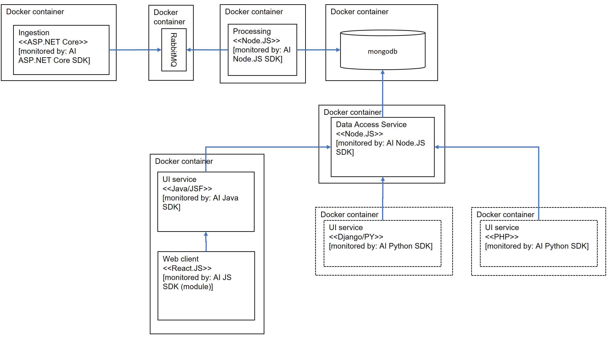
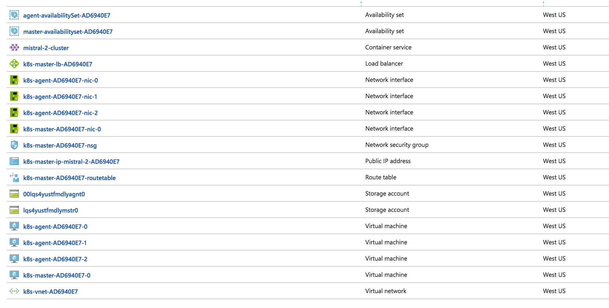

## What is Mistral?

Mistral is a canonical app that showcases how Application Insights can be used on microservices built with popular open source technologies for Linux platform and deployed via Docker.

## Requirements
### P1s
* [P1] Monitor calls made to popular open source storage technology (examples: MongoDB, MySQL)
* [P1] Propagating context via asynchronous transactions spanning multiple services written on different technologies
* [P1] Showcasing Application Insights Java SDK
* [P1] Showcasing Application Insights Node.JS SDK

### P2s
* [P2] Showcasing queue monitoring, i.e. metrics around queue throughput, item in queue duration
* [P2] Showcasing Application Insights SDK for DJango
* [P2] Showcasing ApplicationInsights SDK for PHP


## Proposed architecture   
The diagram below demonstrates the proposed architecture. 


## Repo structure
* [/src/da](./src/da) - Data Access Service. Docker image: `microsoft/sample-mistral:da`
* [/src/mongo](./src/mongo) - Mongo storage. Docker image: `microsoft/sample-mistral:mongo`
* [/src/mongo/dbinit/test](./src/mongo/dbinit/test) - DB test. Docker image: `microsoft/sample-mistral:dbinit-test`
* [/src/maestro](./src/maestro) - Ingestion service. Docker image `microsoft/sample-mistral:mistral-maestro`
* _(Doesn't exist)_ [/src/pr](./src/pr) - Processing service. Docker image `microsoft/sample-mistral:pr`
* _(Doesn't exist)_ [/src/fe-java](./src/fe-java) - FE Java service. Docker image `microsoft/sample-mistral:fe-java`
* _(Doesn't exist)_ [/src/fe-python](./src/fe-python) - FE Python service. Docker image `microsoft/sample-mistral:fe-python`
* _(Doesn't exist)_ [/src/fe-php](./src/fe-php) - FE PHP service. Docker image `microsoft/sample-mistral:fe-php`

## Deploy to ACS with Kubernetes

* [Install Azure CLI](https://docs.microsoft.com/en-us/cli/azure/install-azure-cli)
* Create Azure resource group:
```
RESOURCE_GROUP=mistral-2
LOCATION=westus
az group create --name=$RESOURCE_GROUP --location=$LOCATION
```

* Create Kubernetes cluster
```
DNS_PREFIX=mistral-2
CLUSTER_NAME=mistral-2-cluster
az acs create --orchestrator-type=kubernetes --resource-group $RESOURCE_GROUP --name=$CLUSTER_NAME --dns-prefix=$DNS_PREFIX --generate-ssh-keys
```
* This is what should be created

  * 2 availability sets
  * 2 storage accounts
  * 4 network interfaces
  * 1 network security group
  * 1 route table
  * 1 container service
  * 1 public IP address
  * 4 virtual machines

* Connect to cluster and list nodes
```
az acs kubernetes install-cli
az acs kubernetes get-credentials --resource-group=$RESOURCE_GROUP --name=$CLUSTER_NAME
kubectl get nodes
```

* Run deployment with .yaml file: 
```kubectl create -f k8.yaml```

* After waiting for exposure to propage you can get external IP to da from ```kubectl get svc```


* To update deployment: https://kubernetes.io/docs/concepts/workloads/controllers/deployment/#updating-a-deployment
```kubectl set image deployment/mistral-app da=microsoft/sample-mistral:da_0.1```


## Deploy to minikube
### On Mac
* Install Virtual Box: https://www.virtualbox.org/wiki/Downloads
* Install minikube
```
curl -Lo minikube https://storage.googleapis.com/minikube/releases/v0.19.1/minikube-darwin-amd64 && chmod +x minikube && sudo mv minikube /usr/local/bin/
```
* Start minikube

```minikube start```

* Deploy to minikube

```kubectl create -f k8.yaml```

* Get url to service

```minikube service --url mistral-service```

* Example: run bash inside one of containers

```kubectl exec -it mistral-app-3375841280-zbv7q -c mongo -- /bin/bash```


## Clean up kubernetes deployment

To delete deployment and service: 

```kubectl delete deployment mistral-app && kubectl delete service mistral-service```

## Install using docker-compose

* Deploy with docker-compose in detached mode
``docker-compose -f docker-compose.yaml up -d``

## Set up after installation
* Create user on mongo
``docker exec -it mongo mongo admin``
``db.createUser({user:'unit_test_user', pwd: 'run',roles: [{ role: "userAdminAnyDatabase", db: "admin" }, { role: "root", db: "admin" } ]})``

## Stop and delete containers, remove images
``docker stop $(docker ps -a -q)``
``docker rm $(docker ps -a -q)``
``docker rmi -f $(docker images -a -q)``

## Next steps
* Publish `mistral-da` and `mistral-dbinit-test` images to Microsoft image repository
* Create container cluster using Kubernetes and publish to Azure using Azure Container Service
    * Now we have official instance of `mistral` running in Azure
* `da` next steps
    * Enable raw data endpoint
    * Enable metric data endpoint
* Create Data generator and purger
* Create PHP FE
* Create Python FE
* Create View generator. Look into: [Selenium on Docker](https://github.com/SeleniumHQ/docker-selenium)
* Enable Application Insights for Docker running in a separate container


